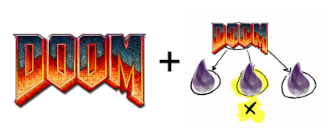

# DoomSupervisor Linux Clone

This is a clone of https://github.com/amalbuquerque/ great talk and presentation. It includes fixes to make it run on linux and adds commits to gzdoom that I think he missed pushing: https://github.com/dominicletz/gzdoom

My Copy of his slides that I presented in the Berlin Elixir Meetup on June 8th you can find here:

https://docs.google.com/presentation/d/1vzB8-pmvuJcUC-wD35Q15gPJNmXPZgQDnR7ZCGRQfek/edit#slide=id.p

You have to compile the custom gzdoom version at https://github.com/dominicletz/gzdoom and then start this project and point it to where your custom gzdoom version is at. E.g. on my machine that is:

```bash
GZDOOM=/home/dominicletz/projects/gzdoom/build/gzdoom ./run 
```

Ah and don't forget these import doom console commands:

- `noclip` walk through walls
- `god` can't be hurt
- `give all` get all the weapons
- `fly` fly!

Cheers!

# DoomSupervisor



Presented at the "Lisbon |> Elixir 19th Edition" meetup on Apr 18, 2023 with the title "Doomguy visits the BEAM".

https://www.meetup.com/lisbon-elixir/events/292379655/

You can find the presentation slides on: https://docs.google.com/presentation/d/186mjb7BGxDxc1UB7qyNDkh35x0iEwUai5VrXvroUqBE/edit?usp=sharing


## Instructions

To start your Phoenix server:

  * Install dependencies with `mix deps.get`
  * Start Phoenix endpoint inside IEx with `iex -S mix phx.server`

Now you can visit [`localhost:4001/dynamic_supervisor`](http://localhost:4001/dynamic_supervisor) from your browser.

Remember to start the Doom game before with `DoomSupervisor.GameServer.start_game()`.
